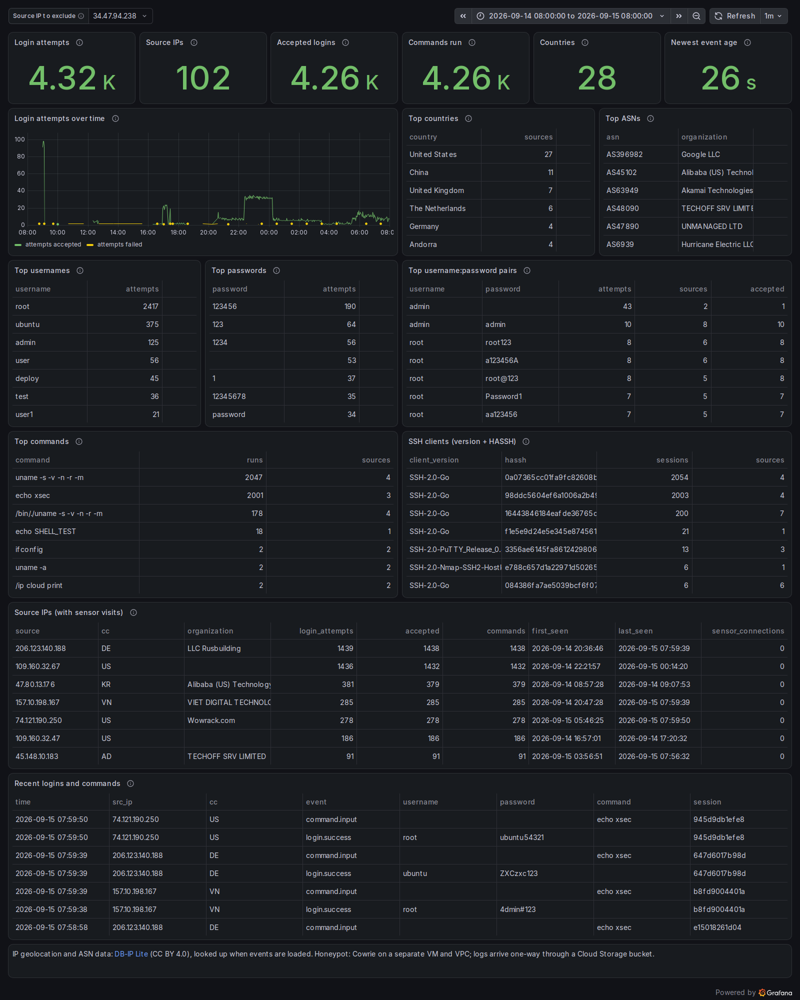
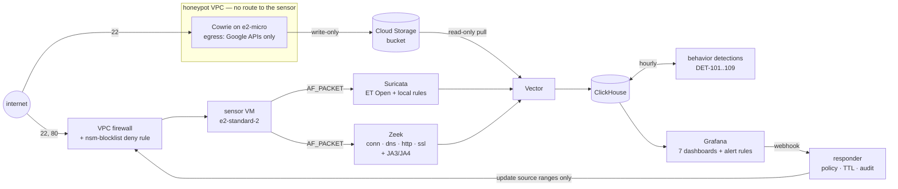
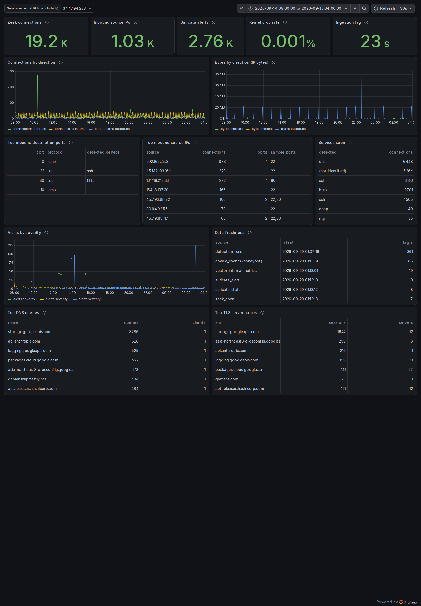
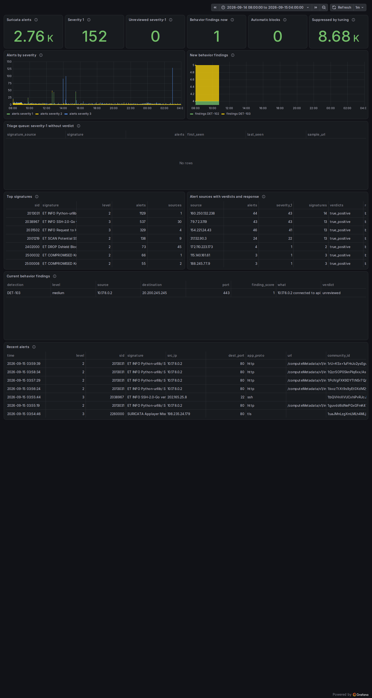
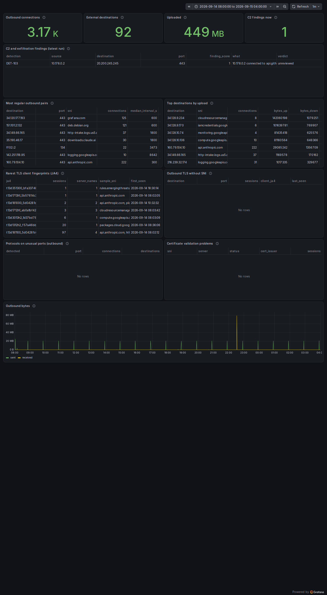
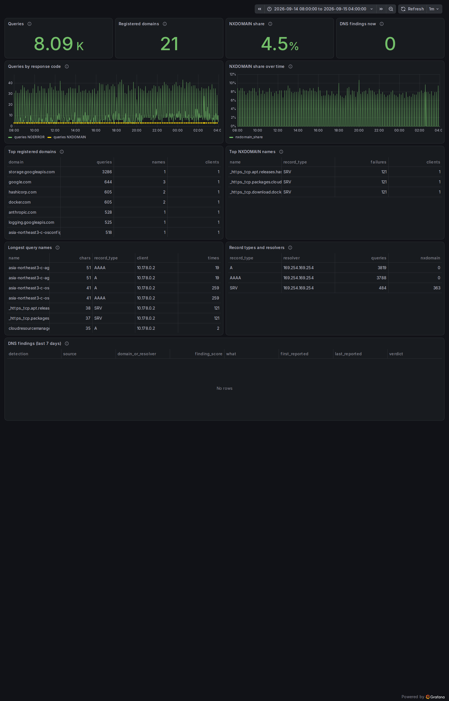
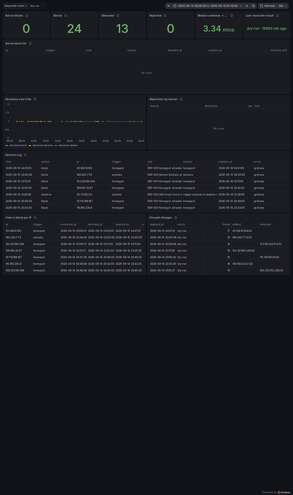
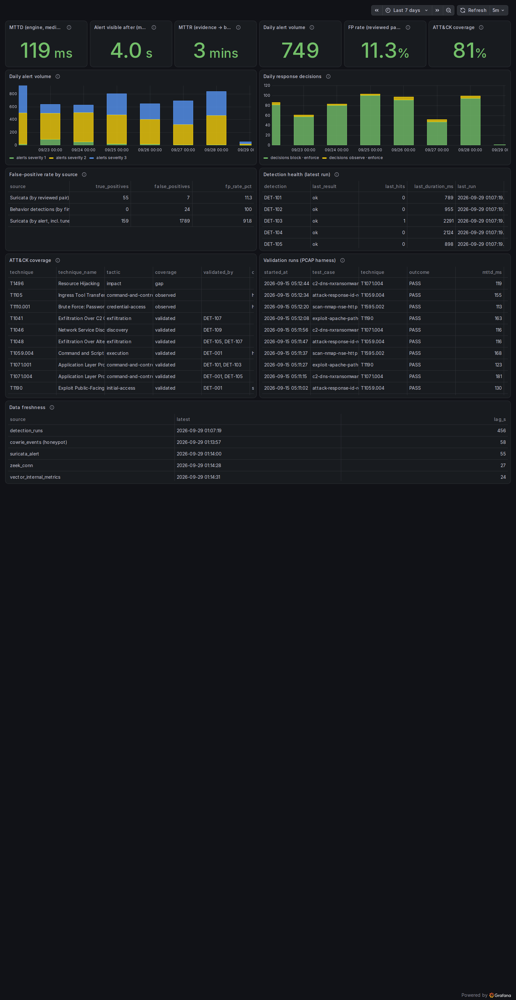
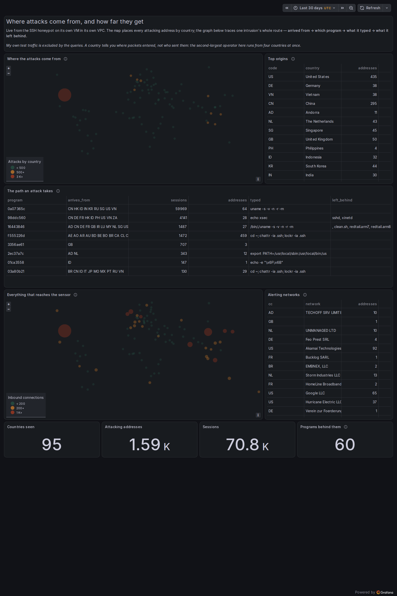

# NSM Lab — Detection → Visualization → Automatic Blocking on GCP

**A network security monitoring lab on a single internet-exposed Google Cloud VM.** Live attack traffic is inspected by Suricata
and Zeek, an isolated Cowrie honeypot collects attacker behavior, behavior detections run as ClickHouse SQL, seven Grafana
dashboards visualize everything, and a responder turns alerts into GCP firewall blocks that expire on their own.

Every detection has a replayable validation, every false positive has a tuning record, and every number in this README comes
from a query against the running lab.




## In short

| | |
|---|---|
| **What** | One internet-exposed VM, watched end to end: sensors → detections → dashboards → automatic blocking |
| **Detection** | Suricata signatures for known threats, Zeek metadata for behaviour; 9 behaviour detections as ClickHouse SQL |
| **Response** | Alerts become GCP firewall rules that expire on their own — **166 s** from first evidence to rule confirmed |
| **Honeypot** | Cowrie on a separate VM in a separate VPC, logs shipped one-way |
| **Proof** | Every detection has a replayable validation; every false positive has a tuning record with a measured effect |

## Contents

- [Highlights](#highlights)
- [Architecture](#architecture)
- [Results](#results)
- [Dashboards](#dashboards)
- [Case studies](#case-studies)
- [Detections](#detections)
- [Security design](#security-design)
- [Repository layout](#repository-layout)
- [Getting started](#getting-started)
- [Validation](#validation)
- [Limitations](#limitations)
- [Documentation](#documentation)
- [Acknowledgements](#acknowledgements)

## Highlights

- **Signatures + behavior, kept separate** — Suricata answers "is this a known threat?", Zeek records "what happened?", and nine
  behavior detections (beaconing, DNS tunneling, DGA, exfiltration, rare TLS fingerprints, …) run as parameterized ClickHouse SQL.
- **Honeypot intelligence protects production** — attackers who log in to the isolated Cowrie honeypot are blocked on the real
  sensor before they arrive, in **166 seconds** end to end.
- **Automated response with guard rails** — Grafana alert → responder policy (never-block list, rate caps, TTL escalation) →
  one GCP deny rule. The VM's credential can update only that deny rule, verified by a negative test.
- **Measured, not claimed** — MTTD, MTTR, false-positive rate and ATT&CK coverage are live dashboard panels backed by audit tables,
  replayed attacks and analyst verdicts.
- **Runs on 2 vCPU / 8 GB** — six containers with explicit memory limits (5.5 GiB total), daily partitions and TTLs.
- **Everything as code** — Terraform, idempotent setup scripts, dashboards generated by Python, provisioned alert rules.

## Architecture



| Component | Role |
|---|---|
| **Suricata 8** | Signature detection with ET Open (52,744 rules) on AF_PACKET; EVE alerts with community ID |
| **Zeek 8 LTS** | Connection, DNS, HTTP, TLS and certificate metadata; custom JA3/JA4 script cross-checked against Suricata |
| **Vector** | Parses and ships logs into ClickHouse with disk buffers; enriches honeypot sources with country and ASN |
| **ClickHouse** | Log store and detection engine — columnar compression keeps months of Zeek data on a small VM |
| **Grafana** | Seven dashboards and three alert rules that feed the responder |
| **Cowrie** | SSH honeypot on a separate VM and VPC; logs leave one-way through a Cloud Storage bucket |
| **Responder** | Python service: webhook → policy decision → reconciles one VPC deny rule; append-only audit trail |

## Results

Measured between 2026-09-13 13:00 and 2026-09-15 05:40 UTC.

| Measure | Value |
|---|---|
| Traffic observed | 44k Zeek connections · 6.1k Suricata alerts on the internet interface |
| Honeypot activity | 29k events · 98 sources · 28 countries · 3.6k login attempts |
| **MTTD** (replayed attack → Suricata alert) | median **123 ms** |
| Alert searchable in ClickHouse | median **4.0 s**, p90 7.7 s (was 5.0 s / 13.2 s before a Vector polling fix) |
| **MTTR** (first evidence → firewall rule confirmed) | **166 s** honeypot path (automatic, enforce) · 30 s Suricata path (dry-run) |
| False-positive rate | **11.3%** of reviewed Suricata signature/source pairs (7 of 62) |
| ATT&CK coverage | **13 of 16** target techniques validated (81%) · 2 observed only · 1 gap |
| Tuning records | 18 (TUNE-001 … TUNE-018), each with cause, change and measured effect |

Definitions and raw measurements: [docs/kpi.md](docs/kpi.md).

## Dashboards

All dashboards live in the **NSM** folder. The time picker controls the period; the ⓘ next to each panel explains it.

| If you want to know… | Open |
|---|---|
| Is everything running, and what traffic arrives? | **Traffic Overview** |
| What was detected, and what still needs review? | **Alerts** |
| Is the server secretly talking to something bad? | **C2 Hunt** |
| Anything odd in DNS? | **DNS** |
| Who attacks the honeypot, and how? | **Honeypot** |
| What did the automatic blocking do? | **Response** |
| How well does the whole system work, in numbers? | **SOC KPI** |

<details>
<summary><b>Traffic Overview</b> — the big picture and pipeline health</summary>

Connections and bytes over time (inbound vs outbound), ports that get hit, busiest sources, detected protocols, top DNS names and
TLS server names, and a **data freshness** table showing how recently each data source delivered. Flat lines or growing lag mean
something broke; spikes mean something happened.


</details>

<details>
<summary><b>Alerts</b> — detections and the triage queue</summary>

Suricata alerts by severity, **severity-1 alerts without an analyst verdict** (the to-do list), top signatures, attacker addresses
with their verdict and whether they were blocked, the latest behavior-detection findings, and the raw alert list with community
IDs to pivot into Zeek.


</details>

<details>
<summary><b>C2 Hunt</b> — suspicious outbound behavior</summary>

Findings from the command-and-control and exfiltration detections, **connections that repeat like clockwork** (how malware
check-ins look), destinations receiving the most uploaded data, the rarest TLS client fingerprints (JA4), TLS without a server name,
protocols on unusual ports and certificate problems. Most entries are normal software; the job is explaining each one.


</details>

<details>
<summary><b>DNS</b> — lookups, failures and tunneling signs</summary>

Lookup volume by answer code, share of non-existent-domain answers (NXDOMAIN) over time, top domains, top failing names, the longest
names, record types and resolvers, and DNS tunneling / DGA findings. Bursts of random failing names suggest a DGA; many long names
under one domain suggest data tunneled through DNS.


</details>

<details>
<summary><b>Honeypot</b> — attacker research</summary>

Login attempts, accepted logins, commands typed, countries and ASNs, the usernames and passwords bots guess, the commands they run,
SSH client fingerprints (HASSH — one fingerprint across many IPs is one tool), and **attackers who also touched the real sensor**.
Country and ASN come from DB-IP Lite at ingest time.


</details>

<details>
<summary><b>Response</b> — what the automatic blocking did</summary>

A mode switch (`enforce` = real blocks, `dry-run` = the test period), the active block list with expiry, every decision in an
audit log, refused blocks by reason (guard rails at work), time to block per IP, and each change pushed to the GCP firewall.


</details>

<details>
<summary><b>SOC KPI</b> — the report card</summary>

MTTD, alert latency, MTTR (only clean samples), daily alert volume, false-positive rate, ATT&CK coverage, detection health for
the hourly jobs, the coverage table per technique, and the history of replayed validation attacks.


</details>

<details>
<summary><b>Attack map and path</b> — where attacks come from, and how far they get</summary>

Every attacking address placed by country, and one row per program behind them: where its sessions arrived from, what
it typed after logging in, and what it left behind. The fingerprint is the actor; the country is only where the
packets entered. The busiest program here runs from nine countries at once, which is exactly why the country ranking
beside it is the least useful thing on the page.


</details>

## Case studies

Times are UTC. Each step is backed by a row in ClickHouse, a Zeek log or the GCP API.

### 1 · RedTail exploit sweep → block decision in 30 s → a new validated detection

A cryptomining botnet (user agent `libredtail-http`) hit the exposed dashboard with exploits for Apache 2.4.49 path traversal
(CVE-2021-41773), PHP-CGI argument injection and ThinkPHP RCE.

| Time | Event |
|---|---|
| 2026-09-14 09:48:00.2 | 46 exploit requests begin, e.g. `POST /cgi-bin/.%2e/…/bin/sh` |
| 09:48:00.5 | Suricata: *ET EXPLOIT Apache HTTP Server 2.4.49 Path Traversal* — 22 severity-1 alerts across 12 signatures |
| 09:48:06.7 | Responder decides a 6-hour block (dry-run phase) |
| 09:48:30.3 | Block list updated — **29.8 s after the first alert** |
| 15:48:13 | Block expires automatically |
| later | Alerts verdicted true positive; the request became a replayable test case for **T1190**, raising ATT&CK coverage to 13/16 |

### 2 · Honeypot credential bot → preventive block on the real sensor in 166 s

| Time | Event |
|---|---|
| 2026-09-13 20:00 | 206.123.140.188 makes 9 connections to the sensor |
| 2026-09-14 20:36 → | The same address logs in to the honeypot as root and runs `echo xsec` — 1,166 successful logins overnight |
| 2026-09-15 05:30:30.2 | New honeypot session |
| 05:33:00 | Grafana alert *RSP-001 Honeypot attacker* fires |
| 05:33:05.0 | Responder decides a 24-hour block |
| 05:33:16.2 | GCP firewall rule confirmed by reading it back — **166 s from evidence** |

### 3 · The dashboard user looked like an attacker → tuning → a live block test

| Time | Event |
|---|---|
| 2026-09-14 07:35 | Suricata severity 1 *Possible SQL Injection SELECT CONCAT in HTTP Request Body* against port 80 |
| 07:36:06 | Responder decides a 6-hour block (dry-run) |
| ~08:10 | Triage: it is the owner's phone using Grafana, whose panel SQL (`concat(…)`) travels in POST bodies |
| 08:12 | **TUNE-011** — the response ignores Grafana's datasource API (Suricata still alerts); the signature is kept out of the IPS drop list |
| 2026-09-15 04:23 | Same signature from the phone again → no block decision |
| 04:25:15 → 04:25:22.6 | Enforcement test: phone blocked, rule confirmed in 7 s; page hangs; Zeek sees **0 connections** |
| 04:26:38 → 04:27:57 | Released in 16 s; the dashboard loads again |

The same discipline caught a beacon **from the sensor itself** to a Datadog log intake every 30 minutes: `ss -tnp` attributed
it to the Claude Code session used to build the lab, and it was allowlisted with an expiry (TUNE-016).

## Detections

| ID | Detection | Engine | ATT&CK |
|---|---|---|---|
| DET-000 | Pipeline canary | Suricata local rule | — |
| DET-001 | ET Open ruleset, 4 replayed attack cases | Suricata | T1595.002, T1059.004, T1071.004, T1190 |
| DET-101 | Beaconing (median/MAD interval regularity) | ClickHouse SQL | T1071.001 |
| DET-102 | Long connections | ClickHouse SQL | T1071 |
| DET-103 | Rare TLS client fingerprint (JA4) | ClickHouse SQL + Zeek script | T1071.001, T1573.002 |
| DET-104 | Suspicious server certificate | ClickHouse SQL | T1573.002, T1587.003 |
| DET-105 | DNS tunneling (label length + entropy) | ClickHouse SQL | T1071.004, T1048 |
| DET-106 | DGA suspicion (NXDOMAIN spike) | ClickHouse SQL | T1568.002 |
| DET-107 | Exfiltration (upload ratio, off-hours bulk) | ClickHouse SQL | T1048, T1041 |
| DET-108 | Standard protocol on a non-standard port | ClickHouse SQL | T1571 |
| DET-109 | Port and host scanning | ClickHouse SQL | T1046, T1595.001 |
| RSP-001 | Honeypot attacker → block 24 h | Grafana alert → responder | — |
| RSP-002 | Severity-1 Suricata alert → block 6 h | Grafana alert → responder | — |
| RSP-003 | SSH brute force / scanning → observe only | Grafana alert → responder | — |

Purpose, logic, validation and false-positive notes for each: [docs/detection-catalog.md](docs/detection-catalog.md).
ATT&CK Navigator layer: [detections/attack-map.json](detections/attack-map.json) (generated by `detections/attack-layer.py`).

## Security design

- **Least-privilege blocking** — the sensor's service account holds a custom role limited by an IAM Condition to one firewall rule.
  A rule's action cannot change after creation, so the credential can only ever *deny*. A negative test proves other rules return 403.
- **Guard rails before automation** — never-block list (own addresses, IAP, Google health checks), 200 active / 20 new-per-10-min caps,
  TTL ×4 for repeat offenders up to 7 days, analyst release with suppression. The policy ran in dry-run for 21 hours and all 24
  would-be blocks were reviewed — catching a false positive on the owner's own phone — before enforcement was switched on.
- **Isolated honeypot** — separate VPC with no peering, egress denied except Google APIs (Cowrie's `wget`/`curl` cannot reach
  attacker hosts), write-only bucket identity, and all parsing done on the sensor side as untrusted input.
- **Hardened containers** — explicit memory limits, dropped capabilities, read-only mounts, secrets via Compose secrets, no
  management port on a public interface (Grafana on 80 is a documented exception with compensating controls).
- **No stored cloud credentials** — Terraform uses a user login only for the duration of a plan/apply and revokes it afterwards.

<details>
<summary><b>Repository layout</b></summary>


```
├── docker-compose.yml        # the stack, one memory limit per container
├── infra/
│   ├── terraform/            # VM import, disk, firewall, honeypot VPC/VM/bucket, blocklist rule + scoped role
│   └── scripts/              # idempotent setup-*.sh, retention, rule updates, GeoIP, honeypot pull
├── sensors/                  # Suricata overrides and update filters, Zeek site policy and JA3/JA4 script
├── ingest/                   # Vector pipeline, ClickHouse config, users and schema
├── detections/               # behavior SQL, runner + scheduler, allowlist, verdicts, ATT&CK targets and layer
├── honeypot/                 # Cowrie + Vector stack delivered to the honeypot VM as instance metadata
├── response/                 # responder service, policy, never-block list, analyst CLI
├── dashboards/               # dashboards as code (build.py), JSON, provisioning, alert rules
├── testing/                  # PCAP harness, detection fixtures, beacon simulator, honeypot and responder tests
└── docs/                     # architecture and decisions, catalog, tuning log, KPIs, screenshots
```

An inline IPS variant (Suricata on NFQUEUE with drop rules) lives on the separate branch **`ips-nfqueue`**; `main` stays IDS.
</details>

<details>
<summary><b>Getting started</b></summary>


**Requirements:** a GCP project, a Compute Engine VM (tested on e2-standard-2, Debian 13) with a 100 GB data disk, Terraform ≥ 1.6,
and Docker (installed by the setup scripts). The Terraform code imports an existing VM — adjust `infra/terraform/variables.tf`. Costs come from the VM, the honeypot e2-micro, external IPs, disks and a small bucket.

```bash
# 1. Cloud resources (log in only for the plan/apply, then revoke)
sudo infra/scripts/setup-terraform.sh
cd infra/terraform && cp terraform.tfvars.example terraform.tfvars   # set project_id
terraform init && terraform plan -out=plan.tfplan && terraform apply plan.tfplan

# 2. Host and stack (every script is idempotent)
sudo infra/scripts/setup-hardening.sh && sudo infra/scripts/setup-disk.sh && sudo infra/scripts/setup-docker.sh
sudo infra/scripts/setup-sensor-host.sh && sudo infra/scripts/setup-honeypot-ingest.sh
sudo infra/scripts/setup-response.sh && sudo infra/scripts/setup-stack.sh && sudo infra/scripts/setup-detections.sh

# 3. Open Grafana on port 80 (credentials are generated into .env)
```

The honeypot rollout (bootstrap → live) and the responder's path from dry-run to enforce are described step by step in
[infra/terraform/README.md](infra/terraform/README.md) and [docs/architecture.md](docs/architecture.md) sections 12–13.
</details>

<details>
<summary><b>Validation</b></summary>


```bash
sudo testing/validate.sh                        # replay 4 attack PCAPs through the live pipeline → PASS/FAIL + MTTD
sudo testing/detections/validate.sh             # behavior detections on synthetic traffic through offline Zeek
sudo testing/honeypot/validate.sh               # attack our own honeypot; check events, enrichment, egress blocked
sudo testing/response/validate.sh               # responder policy through its real webhook in test mode (17 checks)
testing/response/check-firewall-permissions.sh  # the VM may update nsm-blocklist and nothing else
sudo testing/fingerprints/crosscheck.sh         # Zeek JA3/JA4 vs Suricata's built-in values on the same PCAP
```
</details>

## Limitations

- Only ports 22 and 80 reach the sensor and TLS 1.3 hides certificates, so scanning and certificate detections are proven on
  fixtures more than on production data.
- The behavior detections have found no real compromise — every production finding was benign software and is tuned with an expiry.
- Resource hijacking (T1496) is not detected yet; password guessing and tool transfer are only observed on the honeypot.
- Alert latency still has occasional ~12 s outliers; pushing EVE through a socket instead of a file would remove polling.
- A blocked source disappears from the sensor's view, which is why scanners are observe-only.

<details>
<summary><b>Documentation</b></summary>


| Document | Contents |
|---|---|
| [docs/architecture.md](docs/architecture.md) | Design per phase, resource budget, network exposure, decisions D1–D7, problems found and fixed |
| [docs/detection-catalog.md](docs/detection-catalog.md) | Every detection: purpose, logic, data, ATT&CK, validation, false-positive notes |
| [docs/tuning-log.md](docs/tuning-log.md) | Every false positive: observation, cause, change, measured result |
| [docs/kpi.md](docs/kpi.md) | KPI definitions, latency breakdown, response timelines |
| [infra/terraform/README.md](infra/terraform/README.md) | Cloud resources, honeypot stages, service-account switch |
</details>

## Related projects

| | |
|---|---|
| [malware-traffic-analysis](https://github.com/junting9817/malware-traffic-analysis) | Public malware captures replayed through Zeek and Suricata; what the standard ruleset caught, and eight rules for what it did not |
| [endpoint-detection](https://github.com/junting9817/endpoint-detection) | Sigma rules from public Windows attack recordings, validated against recordings where they must stay silent |
| [honeypot-report](https://github.com/junting9817/honeypot-report) | This lab's Cowrie data turned into a public report, with the redaction guard built before the report |
| [ct-lookalike-watch](https://github.com/junting9817/ct-lookalike-watch) | Every plausible lookalike of 14 Korean brands, checked against Certificate Transparency |

All four read data this lab produces or share its ClickHouse.

## Acknowledgements

[Suricata](https://suricata.io) · [Zeek](https://zeek.org) · [Cowrie](https://github.com/cowrie/cowrie) ·
[Proofpoint ET Open](https://rules.emergingthreats.net) · [ClickHouse](https://clickhouse.com) · [Vector](https://vector.dev) ·
[Grafana](https://grafana.com) · [MITRE ATT&CK®](https://attack.mitre.org) ·
IP geolocation by [DB-IP Lite](https://db-ip.com) (CC BY 4.0).
