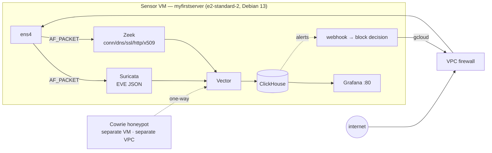
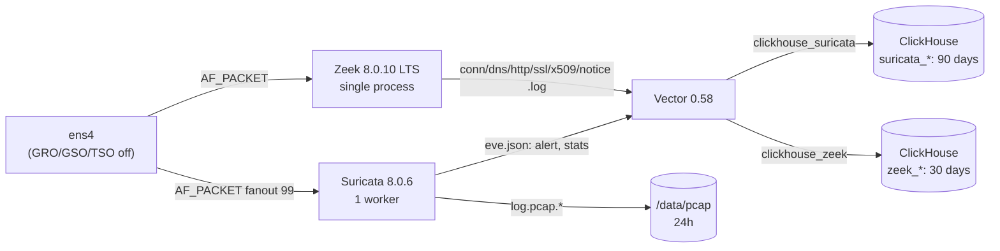
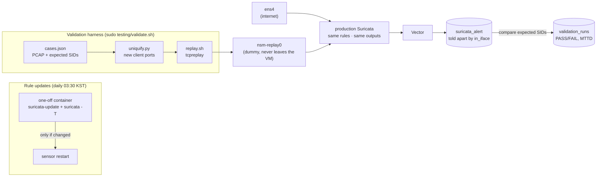
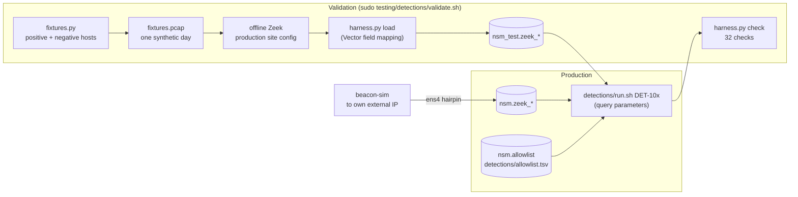
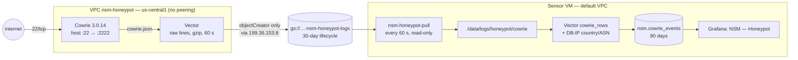
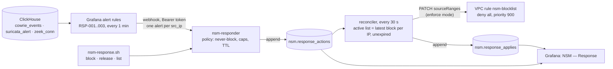
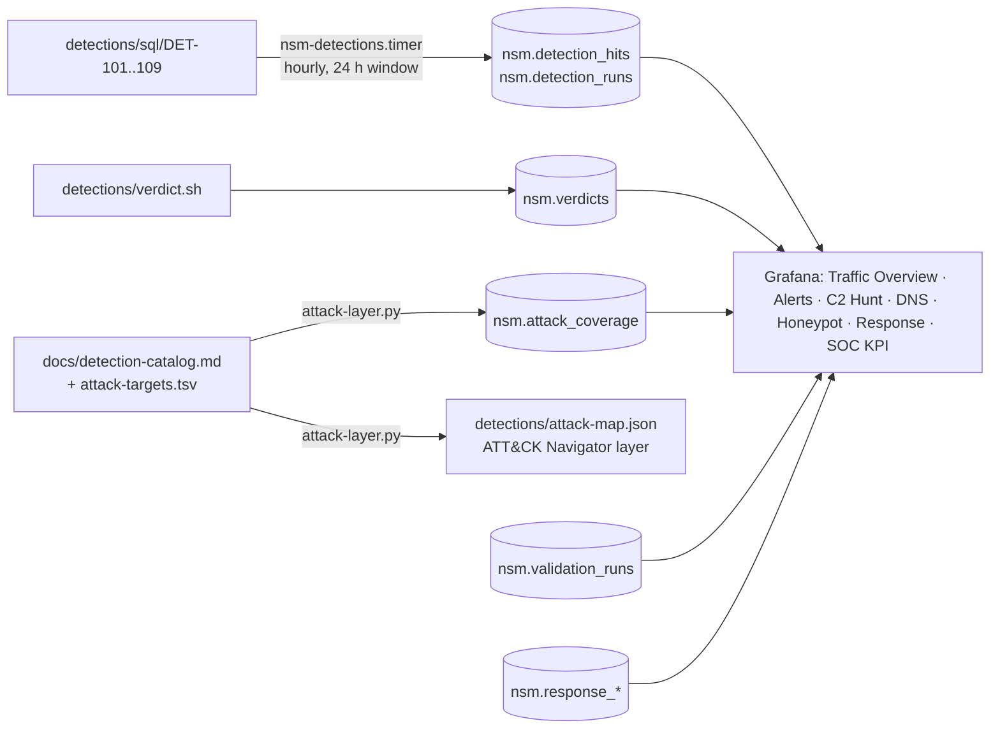

# Architecture

## 1. Overview

| Component | Role | Introduced |
|---|---|---|
| Suricata | **Signature** matching of known threats (ET Open + custom rules) | Phase 2–3 |
| Zeek | **Metadata** for behavior analysis (connections, DNS, TLS, HTTP, certificates) | Phase 2 |
| Vector | Parses and normalizes both logs into ClickHouse; disk buffers prevent loss | Phase 1 |
| ClickHouse | Log store + execution engine for behavior detection SQL | Phase 1 |
| Grafana | Visualization, alert rules → webhook | Phase 1 |
| Cowrie | SSH honeypot (network-separated from the sensor) | Phase 5 |
| Response webhook | Alert triage → VPC firewall block → release when the TTL expires | Phase 6 |

Suricata covers "what is already known", Zeek covers "what happened". Keeping the roles apart is what lets
C2 without signatures (beaconing, DNS tunneling) be caught separately with SQL over Zeek metadata.

## 2. Why ClickHouse

The goal is to keep and aggregate hundreds of millions of Zeek conn rows on **a single 2 vCPU / 8 GB VM**.

- **Columnar storage and compression**: most conn log columns have few distinct values (`proto`, `service`, `conn_state`).
  Storing per column with `LowCardinality` and `Delta`/`ZSTD` codecs removes most of the repetition.
  First measurement (2026-09-14, `system.parts`, 16 h of data): `zeek_conn` 18,598 rows at **3.4:1, 61 bytes/row**;
  `zeek_dns` 6.8:1, `zeek_http` 7.6:1, `suricata_alert` 10.7:1 (including the raw JSON). At this volume the parts are small and
  barely merged, so these ratios are a floor; 61 bytes/row would put 100 million conn rows at about 6 GB. Re-measure at volume.
- **Small fixed memory cost**: unlike search engines that must reserve a large JVM heap up front,
  the server memory cap is set in bytes and queries that exceed it are rejected (section 3).
- **Detection logic maps directly to SQL aggregation**: beacon interval spread is `groupArray` + `arrayDifference` + median/MAD,
  rare JA4 is `count() <= N`, DNS entropy uses array functions. No separate analytics engine is needed.
- **Retention is part of the table declaration**: daily partitions + `TTL ... DELETE` drop old partitions whole.
  Disk-full prevention becomes part of the schema instead of an operating procedure.

Trade-offs:

- Weak full-text search → the design favors structured field queries over raw log text search.
- UPDATE/DELETE are expensive → little impact, since logs are append-only.
- Large JOINs use a lot of memory → use pre-aggregated tables or dictionaries instead of joins.

## 3. Resource budget (e2-standard-2)

Measured: 2 vCPU (AMD EPYC 7B12, 1 core / 2 threads), RAM 7,945 MiB, no swap.
Rule: total container memory limits ≤ 70% of RAM = **5,561 MiB**.

| Component | Phase | Runs as | Memory limit | Internal tuning |
|---|---|---|---:|---|
| ClickHouse | 1 | Docker | 2,048 MiB | server cap 1.6 GiB, smaller caches, `max_threads=2`, merge pool 4 |
| Grafana | 1 | Docker | 768 MiB | no image renderer, `GOMEMLIMIT=640MiB`, unused plugins not loaded (OOM at 256 and 512 MiB, see below) |
| Vector | 1 | Docker | 256 MiB | disk buffers (`/data/vector`) |
| Suricata | 2 | Docker (host net) | 1,536 MiB | `detect.profile: low`, 1 capture worker, restart on rule updates |
| Zeek | 2 | Docker (host net) | 768 MiB | standalone, 1 worker |
| Responder (`nsm-responder`) | 6 | Docker | 128 MiB | Python stdlib only; 24 MiB measured (2026-09-14) |
| **Total** | | | **5,504 MiB (69.3%)** | 57 MiB below the cap |

**Tuning history**

- 2026-09-13 Grafana 256 → 512 MiB: Grafana 13.2.1 restarted 8 times from cgroup OOM during startup
  (kernel log `Memory cgroup out of memory: Killed process (grafana) anon-rss:157588kB, file-rss:182380kB`).
  Loading the 51 bundled plugins alone exceeds 256 MiB.
- 2026-09-13 ClickHouse kept its limit, but its **internal thread pools and caches were reduced**. After 10 hours the memory the server
  tracked was 94 MiB, while the container's anon memory was 1,241 MiB (1,983 MiB in total of the 2,048 MiB limit). Causes: 664 threads
  (`background_schedule_pool_size` defaults to 512) and THP `always`. Smaller pools brought it to 102 threads, and THP was set to `madvise`.
  **Effect**: container memory 10 minutes after start went from 944 MiB (first Phase 1 start) → **149 MiB** (anon 121 MiB, 99 threads).
- 2026-09-15 Grafana 512 → 768 MiB, `GOMEMLIMIT=640MiB`, 22 unused plugins disabled. The kernel had OOM-killed Grafana on 2026-09-14
  10:19:58 (anon-rss 452 MB): a web scanner (161.118.213.33) fetched 209 paths in 23 s including Grafana's JavaScript bundles
  (13.4 MB, largest 4.1 MB) on top of a 326 MiB anon baseline from seven dashboards and alerting. Reproduced against our own Grafana
  on localhost: concurrent bundle downloads with gzip raised anon by ~160 MiB per burst, while 400 small unknown-path requests did not
  move it. Each bundled backend datasource also ran as its own 22–37 MiB process although only ClickHouse is used.
  **Effect** (4 bursts of 44 concurrent bundle downloads): peak anon 666 MiB and 1,402 limit hits with all plugins → 608 MiB and 0
  limit hits with 2 processes left; idle anon 245 → 175 MiB; 0 OOM kills. All 91 panel queries and the 3 alert rules still work.

**Measured in operation (2026-09-13, sensors running 10 hours in Phase 2)**: 0 restarts, 0 OOM kills.
Suricata 43 MiB / Zeek 100 MiB / Vector 103 MiB / Grafana 354 MiB / ClickHouse 1.66 GiB (before the tuning above).
Suricata was small because it only had the canary rule — re-measured after loading ET Open (Phase 3).

**Phase 3 measurement (2026-09-14)**: 52,744 ET Open rules + 1 local rule, `detect.profile: low`, 2 capture interfaces →
Suricata **419 MiB** (peak 425 MiB, 28% of the 1,536 MiB limit), 18 s from start to healthy. The limit stays as is.
Rule update validation (`suricata -T`) runs once a day for about 30 s in a one-off container separate from the sensor (limit 1,536 MiB).

About 2.6 GiB outside the containers:

| Host share | Estimate |
|---|---:|
| OS · dockerd · sshd | ~300 MiB |
| Google agents (Ops Agent, osconfig, guest agent) | ~400 MiB (measured 2026-09-13) |
| Claude Code session | ~300–600 MiB |
| Page cache — directly affects ClickHouse read performance | remaining ~1.4 GiB |

- A live rule reload makes Suricata build a second detection engine and briefly use twice the memory.
  With a 1.5 GiB limit that risks OOM, so the container is restarted after rule updates (accepting a capture gap of a few seconds).
- The CPU is 1 core / 2 threads, so Zeek and Suricata are limited to 1 worker each.
- If limits run short: first shrink rule categories and tune queries, then move to `e2-standard-4` (no component changes).

## 4. Disk and retention

The boot disk (10 GB) is for the OS only. All data lives on `nsm-data` (100 GB pd-balanced) → `/data`.

| Path | Contents | Retention |
|---|---|---|
| `/data/docker`, `/data/containerd` | container images and layers | — |
| `/data/clickhouse` | ClickHouse data | table TTLs (Zeek 30 days, Suricata 90 days, pipeline metrics 7 days) |
| `/data/grafana` | Grafana DB and plugins | — |
| `/data/vector` | Vector disk buffers | up to 256 MiB per sink |
| `/data/logs/{suricata,zeek}` | raw logs (Vector input) | rotated hourly, deleted after 48 hours (section 9) |
| `/data/pcap` | Suricata full-packet PCAP | 24 hours + size cap of 100 MiB × 100 files |
| `/data/suricata` | Suricata rule store (Phase 3 suricata-update) | — |
| `/data/logs/honeypot/cowrie` | Honeypot events pulled from the bucket (Phase 5) | one file per UTC day, deleted after 48 hours |
| `/data/geoip` | DB-IP Lite country/ASN databases (Phase 5) | replaced monthly |

Extra safeguards: container logs 10 MB × 3 files, journald at most 500 MB, ClickHouse system log tables limited to the ones needed, kept 7 days.

## 5. Network exposure

| Port | Service | Host binding | VPC firewall (Terraform) | Notes |
|---|---|---|---|---|
| 22/tcp | sshd | 0.0.0.0 | `default-allow-ssh`: `0.0.0.0/0` (D5), `nsm-allow-iap-ssh`: `35.235.240.0/20` | key authentication only |
| 80/tcp | Grafana | **0.0.0.0 (D3)** | `nsm-allow-dashboard-http`: `dashboard_source_ranges` | plain HTTP |
| 8123/tcp | ClickHouse HTTP | 127.0.0.1 | none | for host scripts |
| 9000/tcp | ClickHouse native | not published (container network) | none | Grafana only |
| 8686/tcp | Vector API | 127.0.0.1 inside the container | none | for `vector top` |
| 20201, 20202/tcp | Google Ops Agent | 0.0.0.0 | — | blocked by host ufw |

**Automated blocking (Phase 6, section 13)**: `nsm-blocklist` — ingress deny all, priority 900 (above every allow rule),
target `nsm-sensor`, source ranges = the responder's active block list; disabled while the list is empty.

**Honeypot VPC `nsm-honeypot` (Phase 5, section 12)** — a separate network with no peering or VPN to `default`:

| Rule | Direction | Ports / destination | Source | Stage |
|---|---|---|---|---|
| `nsm-honeypot-allow-cowrie-ssh` | ingress | tcp:22 → Cowrie | sensor external IP/32 (bootstrap) → `0.0.0.0/0` (live) | both |
| `nsm-honeypot-allow-iap-admin` | ingress | tcp:22222 → real sshd | `35.235.240.0/20` (IAP) | both |
| `nsm-honeypot-allow-egress-google-apis` | egress | tcp:443 → `199.36.153.8/30` (private.googleapis.com) | — | both |
| `nsm-honeypot-deny-egress` | egress | all → `0.0.0.0/0`, priority 65000 | — | enabled only in live |

**Docker and ufw**: ports published by Docker take the `nat PREROUTING → FORWARD` path, so
ufw's INPUT rules do not apply. Container port exposure is therefore controlled not by ufw but by
① the **binding address** (`127.0.0.1` vs `0.0.0.0`) and ② the **GCP VPC firewall**.
ufw's job is to block host processes outside containers (sshd, Ops Agent, ...).

**Default network rules (cleaned up 2026-09-13)**: `default-allow-rdp` (3389, every VM) and `default-allow-https` (443) were
deleted with `infra/scripts/cleanup-default-firewall.sh`. `default-allow-ssh` (D5), `default-allow-http` (the same 80/tcp as D3),
`default-allow-icmp` (so the sensor observes internet ping sweeps) and `default-allow-internal` (inside the VPC) are kept.

**Capture visibility**: AF_PACKET capture in Suricata and Zeek receives packets before netfilter,
so traffic that ufw blocks still shows up in detection data. Traffic blocked by the VPC firewall never reaches the VM and is not visible.

## 6. Access paths

| Purpose | How |
|---|---|
| Dashboard | `http://<external IP>/` (account in the VM's `.env`) |
| SSH | Console SSH button, or `gcloud compute ssh myfirstserver --zone=asia-northeast3-c --tunnel-through-iap` |
| ClickHouse queries (on the VM) | `docker compose exec clickhouse clickhouse-client` |
| ClickHouse queries (remote) | Add `-- -N -L 8123:127.0.0.1:8123` to the IAP SSH command, then `http://localhost:8123` |

## 7. Problems hit while building (Phase 1–3)

| Symptom | How it was found | Cause | Fix |
|---|---|---|---|
| Grafana container restarted 8 times | `oom`/`die 137` in `docker events`, kernel log `Memory cgroup out of memory` | Grafana 13 exceeds 256 MiB just by starting | Limit 512 MiB (section 3 tuning history) |
| Vector loaded 0 rows, `Forbidden` | ClickHouse error log `AUTHENTICATION_FAILED`; captured the auth header Vector sent to a local test server | Since Vector 0.58, `${ENV}` interpolation in config files is off by default → the password was sent literally | Compose secret → `/run/secrets` file → Vector `directory` secret backend. The password is also gone from environment variables |
| Datasource health check OK, but every query failed | Grafana `/api/ds/query` response `code: 452 ... shouldn't be greater than 60` | The plugin sends `max_execution_time` (default 60 s + margin) with every query, hitting `grafana_ro`'s 60 s constraint | Set datasource `queryTimeout: "30"`. The constraint stays |
| Suricata `-T` reports missing variables such as `TEREDO_PORTS` | Compared key counts with `--dump-config`: `detect.*` 18 keys → 1 | Top-level nodes in an `--include` file **replace** the defaults entirely (maps are not merged either) | Include only list nodes; set single values inside maps with `--set` → key counts confirmed equal to the defaults |
| Vector failed to start: `template ... has no literal string prefix` | `vector validate` | Vector 0.58 rejects table name templates without a static prefix (`{{ _table }}`) | 3 sinks by family (`zeek_{{ _log }}`, `suricata_{{ _event }}`, fixed name). Side benefit: the alert path is never blocked by Zeek loads |
| ClickHouse container at 97% of its memory limit | `system.metrics` MemoryTracking 94 MiB vs cgroup `memory.stat` anon 1,241 MiB, `/proc/<pid>/task/*/comm` | 664 threads (BgSchPool 512) + THP `always` → RSS the server does not track | Smaller thread pools and caches (102 threads), THP `madvise` (section 3 tuning history) |
| Config file changed, but the warning stayed | Container start time unchanged | `docker compose up` does not recreate a container when only the contents of a bind-mounted file change | After changing sensor or Vector config, `docker compose restart <service>` |
| Replaying the same PCAP again right away produced no alert | No alert for that flow in EVE; the same PCAP had been replayed 46 s earlier | Identical IPs, ports and TCP sequence numbers attach to the closed session still in Suricata's flow table (kept 60 s by default) → not seen as a new connection | Replay a copy with only the client ports changed (`testing/pcap/uniquify.py`). Confirmed 3/3 PASS on two back-to-back runs |
| Validation PASSed but only 1 of 3 cases ran | Row count of the output table | `docker exec -i` inside the loop read stdin and swallowed the case list | Read the list on fd 3 and query without `-i`. A full run fails if cases run ≠ cases defined |
| Validation result INSERT failed with `Cannot parse input` | ClickHouse error message | JSONEachRow does not accept fractional epochs for `DateTime64` | jq converts them to `YYYY-MM-DD hh:mm:ss.ffffff` strings |
| Alerts visible in ClickHouse after ~12 s instead of ~3 s (found 2026-09-14 during re-validation) | Timestamped the eve.json write, `vector tap` output of the file source and ClickHouse `query_log` insert time; reproduced with a scratch Vector on a scratch file | Suricata writes the alert within 15 ms, but Vector's file source only re-checks a file that has been idle for more than ~10 s about every 10 s (measured: 1.3 s delay while active, 1.9–8.5 s after 12–25 s idle). The sink then adds up to its 2 s batch timeout | Not changed yet; the visible latency KPI now reports the real range (`docs/kpi.md`). Options for Phase 7 are listed there |

Lesson: checks that only look at connectivity, like `vector validate` or a datasource health check, **do not prove that data actually flows**.
Completion is judged by growing row counts and real query results.

## 8. Decision records

### D1 — Keep the existing VM (Debian 13) and bring it under Terraform with `import` (2026-09-13)

- **Context**: the spec said Ubuntu 22.04, but a Debian 13 VM already existed.
- **Decision**: do not create a new VM; import the existing one into Terraform.
- **Rationale**: the only extra cost is the data disk. Every component runs in a container (D4), so distribution differences matter little.
- **Cost**: the VM was created in the console, so some attributes (boot disk, metadata, Shielded VM) are left to `ignore_changes`.
  Swapping the service account needs a VM stop, so it is split out behind a variable (`attach_dedicated_sa`).

### D2 — Terraform runs on the VM, user credentials exist only while it runs (2026-09-13, revised the same day)

- **Context**: the VM's default service account has no Compute API scope, so `terraform plan` is impossible with it.
  The first decision was "run in Cloud Shell, keep no credentials on the VM", but it required copying code
  and relaying plan output every time, so it was changed the same day to the following.
- **Decision**: Terraform runs on the VM. The user logs in from a separate SSH window with `gcloud auth application-default login`,
  and the token is revoked with `gcloud auth application-default revoke` as soon as plan/apply finishes.
- **Risk**: while logged in, a token with project owner privileges exists as a file on an internet-exposed VM
  (`~/.config/gcloud/application_default_credentials.json`).
- **Compensating controls**:
  - Keep the login window as short as one plan/apply task, then revoke and confirm the file is gone.
  - Apply only after the user has reviewed and approved the plan.
  - SSH allows key authentication only (hardening script).
  - Longer term, consider narrowing privileges with impersonation of a dedicated SA.
- **State**: `infra/terraform/terraform.tfstate` is a local file and is not committed (`.gitignore`).
  If the VM disappears, so does the state; move it to a GCS backend when that becomes necessary.

### D3 — Publish Grafana on `0.0.0.0:80` (2026-09-13, user decision)

- **Context**: the original design was a `127.0.0.1` binding + IAP SSH forwarding, but the user wanted to connect directly on port 80.
- **Risks**:
  1. Plain HTTP can expose login credentials on the path.
  2. It becomes a target for internet-wide scanners and brute forcing.
  3. Any Grafana vulnerability is directly an external attack surface.
  4. A compromised Grafana can read ClickHouse data.
- **Compensating controls**:
  - The default admin name (`admin`) is not used, and `setup-stack.sh` generates a random password.
  - Sign-up, anonymous access, org creation and external snapshots are off.
  - Login brute-force protection is on both per account (default) and **per IP**.
  - Cookie `SameSite=strict` and the CSP header are on.
  - Grafana's ClickHouse account is `readonly=2` with `SELECT` on the `nsm` DB only; query memory and time limits are pinned by constraints.
    Even if compromised, writes and DDL are impossible.
  - ClickHouse and Vector ports are not published externally.
  - Image versions are pinned and updated when security advisories come out.
  - The VPC firewall source range is managed with the `dashboard_source_ranges` variable. **Narrowing it to your own IP/32 is recommended.**
- **Side effect**: real scanner traffic arriving on port 80 becomes detection data for Suricata and Zeek from Phase 2 on.
- **Revisit when**: HTTPS is introduced, or there is no longer a need to show it externally.

### D4 — Run Suricata and Zeek in containers too (2026-09-13)

- **Decision**: run them as containers (`network_mode: host`, `NET_RAW`/`NET_ADMIN`) instead of host packages.
- **Rationale**: not tied to Debian 13 package support, and cgroups enforce memory limits.
  This is a decision about how components run, not a component swap.

### D5 — Keep SSH 22/tcp open to the internet (2026-09-13, user decision)

- **Context**: the original spec said "administrative access via IAP only". But connecting with the console SSH button to a VM
  with an external IP requires allowing 22/tcp from `0.0.0.0/0` (Compute Engine SSH-in-browser documentation). The user connects with that button.
- **Decision**: keep `default-allow-ssh` (0.0.0.0/0 → 22). `nsm-allow-iap-ssh` stays as well to keep the IAP path available.
- **Risk**: internet-wide SSH brute forcing and exposure to sshd vulnerabilities.
- **Compensating controls**: key authentication only, no root login, `MaxAuthTries 4`, automatic security updates (hardening script).
  The cleanup script (`cleanup-default-firewall.sh`) also refuses to delete this rule.
- **Revisit when**: moving from the console button to `--tunnel-through-iap` from Cloud Shell or a local gcloud.
  Even then, existing connections survive the rule change (firewall changes apply only to new connections).

### D6 — Honeypot placement and exposure (2026-09-14, user decisions)

- **Region and size**: `us-central1` e2-micro. The user had no region preference; us-central1 is a Compute Engine Free Tier
  region for one e2-micro (eligibility depends on the billing account; the external IPv4 address is billed regardless).
  Cowrie + Vector limits total 576 MiB of 1 GiB. Attacker data then comes from a second geography as a side effect.
- **Egress**: Google APIs only once live (user choice). Cowrie's `wget`/`curl`/`tftp`/`nc` commands open real connections to
  attacker-chosen hosts and SSH forwarding would relay traffic; the VPC firewall is what guarantees none of it leaves.
  Cost: no in-place OS updates — the VM is rebuilt (bootstrap stage → live) instead of patched.
- **Exposure**: SSH 22/tcp only (user choice); Telnet stays off.
- **Revisit when**: honeypot volume needs more than an e2-micro, or other services (Telnet, HTTP) are wanted.

### D7 — Automated response design (2026-09-14; user had no preference, recommended options taken)

- **Credential**: the sensor VM switches to the dedicated `nsm-sensor` service account (`cloud-platform` scope, least-privilege IAM),
  and that account gets a custom role limited by an IAM condition to the `nsm-blocklist` rule and its network. No key files.
  Cost: one stop/start of the VM, run from Cloud Shell because this session and the Terraform state live on the VM. The external
  IP is promoted to static first, since an ephemeral address is released on stop. This also completes the long-pending switch away
  from the default Compute Engine account, which usually holds project Editor.
- **Why one deny rule**: a rule's action and direction are immutable, so updating its source ranges can only ever block traffic.
- **Triggers**: honeypot attackers and severity-1 Suricata alerts are enforced; SSH brute force/scanning is observe-only, because
  blocking at the VPC firewall removes that traffic from the sensor's view, and observing it is the sensor's purpose.
- **Rollout**: dry-run first (decisions recorded, firewall untouched); enforcement is a separate approval.
- **Alternatives rejected**: a service account key (long-lived, copyable credential on an internet-facing host); host nftables
  (no GCP credential, but deviates from the spec and still lets the traffic reach the VM).

## 9. Sensors and collection path (Phase 2)

### Capture

- Both sensors read `ens4` with AF_PACKET on the host network. Capabilities are `cap_drop: ALL` plus only what capture needs
  (Zeek: `NET_RAW`, `NET_ADMIN` / Suricata: additionally `SETUID` and friends to drop privileges). Suricata runs as the `suricata` user after startup.
- NIC offloads (GRO/GSO/TSO) are off. With them on, capture sees "packets larger than the MTU" before the kernel merges or splits them,
  so stream reassembly and analysis differ from the packets actually on the wire (`nsm-nic-offload.service`, runs at boot before Docker).
- virtio checksum offload leaves outbound checksums empty, so both sensors skip checksum validation (Suricata `checksum-checks: no`, Zeek `-C`).

### Role split and join key

- **Suricata EVE carries only `alert` and `stats`**. Zeek owns flow/dns/tls/http metadata.
- Both sensors log **community_id** (seed 0), so an alert leads straight to the same flow in Zeek conn/ssl/http.
- The Zeek site policy is the default `local.zeek` minus `detect-MHR`, which looks up observed file hashes externally (Team Cymru) over DNS.

### How Suricata is configured

The default `suricata.yaml` stays untouched; only the changes are managed.

- `sensors/suricata/nsm.yaml` (`--include`): list nodes that are replaced whole — `af-packet`, `outputs`, `rule-files`
- `--set` in `docker-compose.yml`: single values inside maps — `HOME_NET`, `detect.profile`, memcaps, `stats.interval`
- Why: an include replaces top-level nodes whole (section 7). Verified by comparing `--dump-config` key counts and with `-T`.

### Loading

| Source | Vector transform | Tables | Retention |
|---|---|---|---|
| Zeek `<type>.log` (JSON, flat objects) | dots in keys become underscores (`id.orig_h` → `id_orig_h`), epoch → timestamp | `zeek_conn`, `zeek_dns`, `zeek_http`, `zeek_ssl`, `zeek_x509`, `zeek_notice` | 30 days |
| Suricata `eve.json` | nested objects flattened with underscores (`alert.signature_id` → `alert_signature_id`); alerts also keep the original JSON in `raw` | `suricata_alert`, `suricata_stats` | 90 days |

- Zeek table columns were taken from the fields Zeek 8.0.10 actually logs, extracted with `sensors/zeek/tools/dump-log-schema.zeek`.
- Files are identified by content fingerprint, so reading continues across rotation (renames). Confirmed 0 duplicate `uid`s after a Vector restart.
- `skip_unknown_fields` is used, so a wrong column name silently produces empty values → loads were verified by the **fill rate of key columns**.

### Rotation and retention (`nsm-retention.timer`, on the hour)

1. Rename `eve.json` → `eve.<UTC time>.json`, then `SIGHUP` Suricata (it opens a new file)
2. Delete rotated raw logs after 48 hours (Zeek rotates hourly by itself)
3. Delete PCAPs after 24 hours
- The timer runs as root, so it does not execute the script in the repo directly; it runs a root-owned copy in `/usr/local/sbin`.

### Observation quirks (watch out when self-testing)

- **Hairpin double observation**: a request from the VM to its own external IP is captured both as the outbound flow (`10.178.0.2 → <sensor-external-ip>`)
  and the returning flow (`<sensor-external-ip> → 10.178.0.2`). E.g. in an SQL injection test, Zeek notice recorded the attacker
  under both IPs. The Live Traffic dashboard removes the sensor's external IP from inbound statistics with the `self_ip` variable.
- **TLS 1.3 encrypts certificates**, so most sessions produce no `zeek_x509` row and `zeek_ssl.cert_chain_fps` is empty.
  x509 loading was verified with TLS 1.2 requests. The Phase 4 self-signed detection is designed around this limit.

### 10 hours unattended (2026-09-13 13:00–23:45 UTC)

| Item | Result |
|---|---|
| Container restarts / OOM | 0 / 0 |
| Suricata kernel drops | 0 / 454,646 packets |
| `suricata_stats` loads | 60 rows every hour, none missing |
| `zeek_conn` loads | 416–1,766 rows per hour, no gaps (inbound rose after 18:00) |
| Retention timer | EVE rotated successfully every hour |
| `/data` usage | 5.5 GB (PCAP 290 MB) |

## 10. Signature detection and validation harness (Phase 3)

### Rule management

- **ET Open** comes from suricata-update (52,744 enabled, 0 load failures). Rule files live only in `/data/suricata/rules`; the repo holds only the filters.
- Updates run in a **one-off container separate from the sensor**. Running them in the same container would make the `suricata -T` step
  share the sensor's memory limit and could OOM-kill the sensor. Validation uses the same image (same Suricata version) as the sensor.
- The sensor restarts only when the rule file sha256 changes. Live reload doubles memory, so it is not used (section 3).
- Both paths were run and confirmed: no change → no restart / 1 rule disabled → restart → 52,744 loaded → reverted → 52,745.

### Harness design

| Decision | Reason |
|---|---|
| The **production Suricata** also captures the dummy interface | Validates the real rules, config, EVE, Vector and ClickHouse path instead of a separate test engine. Alerts are told apart by `in_iface` |
| Replay **only onto a dummy interface** (`replay.sh` checks the type) | Packets sent to a dummy go nowhere → replay traffic cannot leak to the internet or VPC. Confirmed that `ens4` is refused |
| **Synthetic PCAPs** (`generate_samples.py`) | Carry only the indicators a rule looks for instead of real malware PCAPs. Byte-for-byte reproducible and free of executable payloads, so they can be committed. Addresses are inside HOME_NET (10.200.0.0/24) and the RFC 5737 documentation ranges |
| Verdicts are based on **what is loaded in ClickHouse** | It is only a detection if an analyst can actually see it. Engine latency (`mttd_ms`) and time until queryable (`visible_ms`) are recorded separately |
| Unexpected alerts are **reported, not failures** | Other rules matching the same traffic (e.g. an ngrok DNS INFO rule) can be valid detections too. The lists were first confirmed offline with `suricata -r` |
| **Negative control** | A temporary case expecting a nonexistent SID confirmed FAIL, exit code 1 and the recorded result (guards against a harness that always passes) |

### Results

- 2026-09-14 (Phase 3): all 3 full runs 3/3 PASS — 2 back-to-back + 1 after a rule update and sensor restart. The separate negative control failed as intended.
  SIDs per case are in `docs/detection-catalog.md` DET-001.
- Re-validation after translating the harness (2026-09-14 02:23–02:33 UTC): 7 more full runs, all 3/3 PASS.
- Engine latency **102–166 ms** across all 36 PASS rows. Time until queryable in ClickHouse is **2.6–13.3 s** (median 5.0 s), plus one 30.8 s run
  that coincided with a `vector tap` debugging session ending. The spread comes from Vector's idle-file polling (section 7, last row) plus the
  2 s alert batch. The 2.6–5.0 s first reported for Phase 3 came from only 3 full runs and understated the spread. Details in `docs/kpi.md`.

### First hour of ET Open in production (ens4, canary excluded)

- Real threats: SSH scans from Spamhaus DROP list IPs and "known hostile hosts" (ET COMPROMISED), Go SSH client scanners.
- False-positive candidate: the sensor's own requests to the GCE metadata server (169.254.169.254) —
  the guest agent's `Go-http-client` (`/credentials/mds-client-certificate`, every minute) and host scripts' `curl`
  trigger 3 user-agent rules (2024897, 2060251, 2034567) → the rules stay, suppressed by destination IP (TUNE-001, `docs/tuning-log.md`).
- Protocol anomaly events (`SURICATA STREAM Packet with invalid timestamp` and similar) mostly come from one scanner's malformed packets.

## 11. Behavior-based detections (Phase 4)

### Design

| Decision | Reason |
|---|---|
| Detections are **parameterized SQL** run by one runner (`detections/run.sh`) | Window, database and thresholds are ClickHouse query parameters (`{name:Type}`), declared with defaults in each SQL header. The exact same file runs against production (`nsm`) and the test database (`nsm_test`), and values are never spliced into SQL text |
| **Common output columns** (`detection_id, severity, src, dst, dst_port, first_seen, last_seen, score, summary`) | Phase 6 response and Phase 7 dashboards can treat all detections the same way |
| **Median/MAD** for beaconing instead of mean/stddev | A beacon that pauses or retries in a burst barely moves them; scoring is explainable per term |
| **Fixture validation through real Zeek** instead of hand-written log rows | Field values such as `history`, `conn_state`, `service`, `validation_status` and JA4 come from Zeek itself, so a detection that passes relies on what Zeek really logs |
| Isolated **`nsm_test` database** without TTL | The fixture day is in the past; production tables and their TTLs are never touched |
| JA3/JA4 **implemented in Zeek** rather than enabling Suricata TLS metadata | Keeps the role split (Suricata = signatures, Zeek = metadata); correctness proven by cross-checking against Suricata |
| **One shared allowlist table** instead of per-query exclusions | Reviewed exceptions live in `detections/allowlist.tsv` (validated and loaded by `detections/sync-allowlist.sh`), each with a TUNE id, reason, expiry and enabled flag. Matching is per connection by TLS SNI (joined on Zeek `uid`), destination IP or CIDR; `use_allowlist=0` shows what an entry suppresses |

### JA3/JA4 implementation and cross-check

- `sensors/zeek/scripts/ja3-ja4.zeek` computes JA3 and JA4 (TLS client) from the ClientHello and adds `ja3`/`ja4` to ssl.log
  (ClickHouse columns via schema 011). Zeek 8.0.10 raises the extension events *before* `ssl_client_hello`; only the first
  ClientHello of a connection is used, and fingerprints are computed in the `SSL::ssl_finishing` hook.
- `testing/fingerprints/crosscheck.sh` runs Zeek and Suricata 8 (built-in JA3/JA4) on the same PCAP and joins flows by community ID.
  On two capture files from this sensor: **292 TLS flows, JA3 292/292, JA4 291/292.** A later capture file (2026-09-14): 76/76 for both.
- The one difference: a TLS 1.1 ClientHello from an internet scanner without a signature_algorithms extension.
  The FoxIO spec says JA4_c is then hashed *without* a trailing underscore; **Suricata 8.0.6 hashes it with one**
  (`sha256("<extensions>_")`). Zeek follows the spec. The cross-check recomputes the Suricata-style hash from the raw JA4
  (`ja4_r`, logged only during the check) and counts a difference as known only in exactly that case; a synthetic
  negative control confirmed that any other mismatch fails the check.

### Validation harness pitfalls found

| Symptom | Cause | Fix |
|---|---|---|
| 7 of 27 checks failed: outbound detections reported nothing, an external scanner was labeled local | Zeek's `Site::private_address_space` includes the RFC 5737 documentation ranges used for fixture peers, and `private_address_space_is_local` defaults to true, so every peer was "local" | Offline Zeek in the harness runs with `Site::private_address_space_is_local=F`; fixture hosts stay local via `Site::local_nets` |
| SSH fixtures had `service` empty | Zeek confirms SSH only after the key exchange (verified on live port-22 traffic: banner-only sessions have no service) | Fixtures send KEXINIT, ECDH init/reply and NEWKEYS |
| `Cannot load time zone 'Asia/Seoul'` | A String parameter default was written with quotes, so the quotes became part of the value | String defaults are unquoted; array defaults use ClickHouse literals |
| `ILLEGAL_AGGREGATION` in DET-104 | An alias reused a column name (`validation_status`) that was also used inside another aggregate | Distinct alias names |

### Live beaconing check

`sudo systemd-run --unit nsm-beacon-live --collect testing/beacon-sim/validate_live.sh` sends two beacons from the sensor to its
own external IP (hairpin through the VPC, so Zeek on ens4 sees them), 60 check-ins at 15 s each, and runs DET-101 on each window
through the production pipeline. Result on 2026-09-14:

| Run | Jitter | Connections | Median / MAD interval | ts_score (predicted ≈ 1 − J/2) | cv_score | Score | Expected | Result |
|---|---|---:|---|---|---|---:|---|---|
| low-jitter | ±20% | 61 | 14.55 s / 1.46 s | 0.899 (0.90) | 0.828 | **0.912** | reported | PASS |
| high-jitter | ±90% | 60 | 12.97 s / 6.58 s | 0.493 (0.55) | 0.434 | **0.630** | not reported | PASS |

The low-jitter window counted 61 connections because the last check-in of a manual smoke test landed in its first second.
The simulator refuses any target other than the sensor's own external IP, loopback or the VPC (checked with `example.com`).

### Production review (24 h ending 2026-09-14 01:15 UTC)

Every hit came from the sensor host (`10.178.0.2`) and maps to known software:

| Detection | Hits | What they were |
|---|---:|---|
| DET-101 beaconing | 3 | Update polling with zero jitter: `grafana.com` and `deb.debian.org` every 600 s, `downloads.claude.ai` every 1800 s |
| DET-102 long connections | 13 | HTTP/2 keep-alive and long polling to `api.anthropic.com` and GCE agent endpoints (`*-osconfig`, `*-agentcommunication.googleapis.com`) |
| DET-103 rare JA4 | 5 | Baseline warm-up: JA4 logging started 00:55 UTC, so only 25 TLS sessions existed |
| DET-107 exfiltration | 5 | Ops Agent metrics to `monitoring.googleapis.com` (up to 84 MiB) and Claude Code prompts to `api.anthropic.com` (88 MiB) |
| DET-104/105/106/108/109 | 0 | — |

These are the classic false-positive classes for behavioral detections on a server: software that phones home on a timer,
agents that long-poll, and telemetry uploads. They are now allowlisted by SNI as TUNE-002..010 (`docs/tuning-log.md`), which took
DET-101 from 3 to 0 hits, DET-102 from 13 to 2 and DET-107 from 5 to 1 over the same window. The residual hits are connections Zeek
picked up mid-stream after a restart, so they carry no SNI to match.

## 12. Honeypot (Phase 5)

> Status 2026-09-14: live. Stage A (bootstrap) and Stage B (egress locked, 22/tcp open to the internet, applied 06:34 UTC) both validated.

### Design

| Decision | Reason |
|---|---|
| **Separate VM in a separate VPC**, no peering | A compromised honeypot has no route to the sensor, ClickHouse or Grafana |
| **One-way transfer through a bucket** instead of pushing to the sensor | No inbound port on the sensor VM. The honeypot identity has only `roles/storage.objectCreator` (create, no read/overwrite/delete), so it cannot touch logs already shipped; the sensor VM only reads, with the `devstorage.read_only` scope it already had |
| **Egress denied except `private.googleapis.com`** once live | Cowrie's download commands and SSH forwarding would otherwise send traffic to hosts we do not own. `storage.googleapis.com` is pinned to `199.36.153.8` (compose `extra_hosts`, `curl --resolve`); tested from a VM with an external IP: HTTP 200 through the VIP. The metadata server (tokens, DNS) is never blocked by firewall rules |
| **Two stages** (`honeypot_stage`) | bootstrap: egress open to install Docker and pull images, Cowrie reachable only from the sensor's IP for testing. live: egress locked, 22/tcp open to the internet. Updates rebuild the VM rather than reopening egress |
| **Nothing parsed on the honeypot** | Vector ships Cowrie's raw lines. Parsing, type forcing and enrichment happen on the sensor, which treats the data as hostile: the puller caps object and decompressed size and keeps only JSON-object lines; `cowrie_rows` copies known fields with forced types and drops non-`cowrie.*` events |
| **Real sshd on 22222, IAP only; OS Login; project SSH keys blocked** | Cowrie owns 22. Normally nobody logs in: Terraform metadata carries the startup script, compose file and configs |
| **Startup log uploaded to the bucket** (`startup/…`) | A failed boot can be diagnosed from the sensor VM with its read-only access, without a user login |
| **Enrichment at ingest** with DB-IP Lite (CC BY 4.0) | Records who held the address when the attack happened; no account or license key; attribution on the dashboard |

### Problems found while building

| Symptom | Cause | Fix |
|---|---|---|
| Cowrie started but wrote no JSON log: `No such file or directory: 'var/log/cowrie/cowrie.json'` | An empty bind mount over `/cowrie/cowrie-git/var` hides the image's directory tree | The startup script creates `log/cowrie`, `lib/cowrie/{downloads,tty}` owned by uid 999 |
| (Would have broken every pull) | Vector uploads objects with `Content-Encoding: gzip` (captured with a local fake endpoint). Cloud Storage then decompresses them on download unless the client accepts gzip | The puller sends `Accept-Encoding: gzip` and also accepts an already-decompressed body |
| (Would have skipped data around midnight) | A `date=%F/` key prefix comes from event time, so a late batch could sort before an object that was already pulled | Flat `cowrie/` prefix, upload-time file names, one upload at a time, and a 2-hour re-list overlap in the puller |
| `Aggregate function any(src_ip) AS src_ip is found in WHERE` in a dashboard query | Alias shadowing the column (same class as DET-104) | Distinct alias names |
| First honeypot boot: startup log `exit127`, `docker: command not found` (read from the bucket's `startup/` object) | Debian 13 splits the CLI into `docker-cli`, only a Recommends of `docker.io` and `docker-compose`; `--no-install-recommends` skipped it | Install `docker-cli` and `apparmor` explicitly and fail loudly if the CLI is still missing; rebuilt with `-replace` (1 destroyed, 1 added), second boot `exit0` |
| A GeoIP test run restarted production Vector | The updater restarts `nsm-vector` whenever databases change, even when pointed at a scratch directory | `RESTART_VECTOR=0` for test runs |

### Validation

- Local (2026-09-14): Cowrie 3.0.14 with the production config on an internal Docker network (no egress). `testing/honeypot/ssh_attempts.sh`
  produced `login.failed` ×2, `login.success`, `command.input`, `client.kex` (HASSH) and `client.version`; Cowrie's `wget` logged
  `file_download.failed`. The same events, rewritten to a public source IP, went through production Vector into `nsm.cowrie_events`
  (19/19 rows, `<sensor-external-ip>` → KR / AS396982 Google LLC) and all 16 Honeypot panel queries returned HTTP 200. Test rows were then truncated.
- Cloud, Stage A (2026-09-14, apply: 13 added, 3 changed — translated descriptions only, 0 destroyed; rebuild after the boot fix):
  `sudo testing/honeypot/validate.sh` → all PASS: Cowrie banner on 22/tcp; `login.failed` ×2, `login.success` and `command.input`
  visible in ClickHouse ~70 s after the attack; `src_ip` = the sensor's external IP (Docker kept the real source); KR / AS396982;
  **egress positive control**: Zeek on the sensor saw the honeypot's `wget` request. The pull timer then ran on its own (1 object, 24 events).
  The user's GCP login (ADC) existed only for the plan/apply session and was revoked right after (D2).
- Cloud, Stage B (2026-09-14, apply: 0 added, 2 changed — Cowrie source `<sensor-external-ip>/32` → `0.0.0.0/0`, deny-egress `disabled` true → false;
  a follow-up plan with `honeypot_stage = "live"` pinned in `terraform.tfvars` reported no changes). `validate.sh` → all PASS, events visible
  after ~140 s — they now travel only through the private.googleapis.com VIP. **Egress blocked**: no request from the honeypot reached
  the sensor within 120 s, Cowrie logged `file_download.failed` for that URL (the Stage A run had logged `file_download`), and Zeek
  recorded 2 connections from the honeypot's IP before the change and 0 after. ADC revoked after the session.

## 13. Automated response (Phase 6)

> Status 2026-09-15: **enforcing** since 04:14 UTC (user approved). End-to-end block test passed; first automatic block of a real attacker still to be observed.

### Design

| Decision | Reason |
|---|---|
| **Grafana alerting** decides *that* something happened; the **responder** decides *what to do* | Alert rules stay simple SQL; guard rails (never-block, caps, suppression, escalation) live in one tested module (`response/webhook/policy.py`) that also serves the analyst CLI |
| **Append-only decisions**, derived block list | The audit trail is the state: every block, release, rejection and observation stays queryable. Expiry needs no job — an expired block simply drops out of the derived list |
| **Reconciler** instead of per-alert API calls | Idempotent: it compares the rule with the desired list and fixes drift from any cause (manual edits, failed calls, restarts), and confirms by reading the rule back before recording `applied_at` |
| **One deny rule** with immutable action | The credential cannot open anything (see D7). Priority 900 beats every allow rule |
| **Guard rails** | Public IPv4 only; never-block list for IAP, Google health checks, the sensor's and the honeypot's IPs; max 200 active and 20 new automatic blocks per 10 minutes; analyst release can suppress re-blocking |
| **Modes** | `dry-run` records the would-be list; `enforce` changes the rule; `test` is dry-run plus TEST-NET-3 attackers for the harness. Rows are kept apart by mode |
| **Hardening** | Container runs as `nobody` with no capabilities, code mounted read-only, no published port (reachable only by Grafana on the internal network), webhook token compared in constant time, ClickHouse account limited to the response and evidence tables. The root filesystem is writable only because Compose cannot inject environment-sourced secrets into a read-only container |

### Problems found while building

| Symptom | Cause | Fix |
|---|---|---|
| `cannot create secret … in read-only service responder: file is the sole supported option` | Compose writes environment-sourced secrets into the container filesystem | Dropped `read_only` for this container only (see Hardening) |
| Reconciler: `Aggregate function argMax(expires_at, created_at) AS expires_at is found inside another aggregate function` | Alias shadowing the column in `HAVING` (third time in this project: DET-104, the Honeypot dashboard) | Distinct aliases |
| A plain release was treated as a 24 h suppression (harness check "repeat offender" failed) | `expires_at` is Nullable and ClickHouse aggregates skip NULLs, so `argMax(expires_at, …)` returned the previous block's expiry | `argMax(tuple(expires_at), …).1`, which keeps the NULL; same form in the dashboard |
| RSP-003 could never fire if copied from DET-109 | Only ports 22 and 80 reach the VM, so a 50-port vertical scan threshold is unreachable for internet sources | Connection-volume signal on 22/tcp, profiled on 24 h of data |
| Dashboard time-to-block panels empty for test rows | They counted only apply results `ok`/`dry-run` | Count every non-error apply |
| After the VM stop/start for the account switch, `nsm-suricata` stayed at exit 255 while every other container restarted (sensor blind until noticed) | `docker ps -a`; no restart attempt or error for it in the Docker journal of either boot | `nsm-stack-boot.service` (setup-stack.sh) runs `docker compose up -d --wait` 45 s after Docker starts; tested by stopping a container and running the unit (restored in 52 s, others untouched) |
| Every responder stop took 10 s and ended in SIGKILL (exit 137) | Python as PID 1 has no default SIGTERM handler | `init: true` in compose: stop now 0.3 s, exit 143 |

### Validation so far

- `python3 testing/response/test_policy.py` — 11/11.
- `sudo testing/response/validate.sh` — 17/17 through the real webhook, CLI, ClickHouse and reconciler (test mode, rows deleted).
- Production dry-run: Grafana evaluated RSP-003 on live traffic and the responder recorded `observe` decisions for two real SSH
  brute-force sources within a minute of deployment. All 12 Response dashboard panels return HTTP 200 in both modes, and on
  harness data they show the active list, rejections by reason and decision-to-list times (~0.8 s with a 3 s reconciler).
- `testing/response/check-firewall-permissions.sh` before the switch (default account): every firewall call 403 (no compute scope).
- Cloud step 1 (2026-09-14 07:38 UTC): `terraform apply` 4 added (static IP `nsm-sensor-ip` still attached to the VM, `nsm-blocklist`
  disabled, role, conditional binding); follow-up plan no changes.
- Cloud step 2 (07:50 UTC): the user switched the VM to `nsm-sensor` with full API scope in the Cloud Console (Cloud Shell was not
  available); the external IP stayed <sensor-external-ip>, the stack, timers and bucket pull kept working under the new account.
- Cloud step 3: `check-firewall-permissions.sh` as `nsm-sensor` → **nsm-blocklist GET/PATCH 200; nsm-allow-dashboard-http and
  nsm-honeypot-deny-egress PATCH 403** (no-op PATCHes). The IAM Condition does scope the firewall permission to one rule.
- First real dry-run decisions changed the triggers before enforcement (docs/tuning-log.md):
  **TUNE-011** — RSP-002 would have blocked the dashboard user's phone for 6 h, because Grafana's panel SQL in `/api/ds/query` POST bodies
  matches an SQL injection signature; the response now ignores that path (Suricata still alerts).
  **TUNE-012** — RSP-001 missed the first real honeypot attacker, who uploaded a binary named `sshd` over SFTP without typing a command;
  file transfers after a login now count. This is the reason dry-run came first.

### Inline IPS variant

Branch `ips-nfqueue` (commits 13532ed, b787f60; not deployed): Suricata on NFQUEUE for 22/tcp and Grafana with drop rules for the two
genuine severity-1 signatures seen here (2053465 removed after TUNE-011), `bypass` + `fail-open`, IAP never queued, `setup-ips.sh enable|disable`. Verified with
`suricata -T` in NFQ mode, an offline drop conversion and the nft ruleset in an isolated namespace. Details and the
IDS-vs-IPS trade-offs in `docs/ips.md` on that branch.

### Remaining steps (each needs approval)

All four steps done. Remaining observations: the first automatic block of a real attacker (MTTR from real evidence), and a
no-change `terraform plan` with `attach_dedicated_sa = true` at the next ADC session.

### Dry-run results before enforcement (2026-09-14 07:08 → 2026-09-15 04:14 UTC)

- 24 would-be blocks (16 honeypot, 8 Suricata) and 13 observe decisions for 5 SSH brute-force sources; no cap or reconciler errors.
- Every Suricata-triggered source was reviewed: 7 genuine (Apache path traversal to `/bin/sh` from 4 sources with 22–43 alerts each,
  a Cisco IOS XE authentication-bypass attempt, a React2Shell attempt, a libssh brute forcer) and 1 false positive — the dashboard
  user's phone (TUNE-011), fixed and released before enforcement.
- The honeypot recorded 28,482 events from 92 sources in its first day (3,531 logins, 3,490 commands, 2 file transfers).

### End-to-end enforcement test (2026-09-15, with the user's phone)

The user opened the dashboard on their phone; its address (<user phone IP>, the only dashboard client in Zeek at the time) was
blocked for 10 minutes through the analyst CLI and released after the check.

| Time (UTC) | Event | Evidence |
|---|---|---|
| 04:14:41 | Responder restarted with `RESPONDER_MODE=enforce` | start log; reconciler read the rule (disabled, placeholder range), no changes, no errors |
| 04:22:57–04:24:30 | Phone loads the dashboard | Zeek: 13 connections, 141 HTTP requests from <user phone IP> |
| 04:25:15 | `nsm-response.sh block <user phone IP> 10m …` | `response_actions` block, expires 04:35:16 |
| 04:25:22.6 | Reconciler PATCH confirmed (2.65 s) | `response_applies` ok, added `<user phone IP>/32`; Compute API: `disabled=false`, sourceRanges `[<user phone IP>/32]` |
| ~04:26 | User reloads: page hangs | Zeek: **0 connections and 0 HTTP requests started after 04:25:22.6** — dropped at the VPC before reaching the VM |
| 04:26:38 | `nsm-response.sh release …` | `response_actions` release |
| 04:26:55.0 | Reconciler confirmed (1.57 s) | added `[]`, removed `<user phone IP>/32`; API: `disabled=true`, placeholder range |
| 04:27:57 | User reloads: page loads | Zeek: connections and HTTP requests from the phone again |

Decision → enforced rule: **7 s** (includes up to one 30 s reconciler interval, here 6 s). Release → removed: 16 s.
The audit trail showed the analyst's reason only in the JSON detail for manual blocks; manual block rows now keep it in `reason`.

## 14. Wrap-up: detections on a schedule, KPIs and coverage (Phase 7)

| Decision | Reason |
|---|---|
| **Scheduled detection runs** stored with a stable `hit_key` | Behavior findings were only visible to whoever ran `run.sh`; stored, they chart, age and carry verdicts. Every run, including failures, is recorded so a detection that silently breaks shows up on the KPI dashboard |
| **Verdicts as data** (`nsm.verdicts`) | The FP rate needs judgements, not guesses. Verdicts are per signature/source pair or per finding, carry the tuning-log ID and the analyst, and the latest one wins |
| **Coverage derived from the catalog** | The Navigator layer and the KPI read technique IDs and status from the catalog index, so coverage cannot drift from the documentation. The denominator is an explicit target list with a reason per technique |
| **Dashboards as code** (`dashboards/build.py`) | Queries are reviewable and reproducible; the builder's header lists the ClickHouse pitfalls the project hit, and every panel query is exercised through Grafana's API before commit |

### What building the KPIs uncovered

| Finding | Evidence | Action |
|---|---|---|
| Top signature was our own tooling: 1,693 Python-urllib alerts to the metadata server | SID 2013031, all 10.178.0.2 → 169.254.169.254:80, rising after enforcement | TUNE-018 suppression; 0 in the following 6 min |
| A 30-minute beacon from the sensor to `http-intake.logs.us5.datadoghq.com` (DET-101, DET-103) | 149 connections, 13.4 MB up; `ss -tnp` during a live connection: process `claude` | Claude Code's telemetry — TUNE-016/017 |
| First automatic blocks measured 920 s and 798 s | Both sources' Grafana alerts had been firing since dry-run; Grafana re-notified only every 4 h (the second one when Grafana restarted) | `repeat_interval` 30 m; the honeypot path's real latency is the dry-run measurement below |
| T1190 (exploit public-facing app) was the most common real attack but had no validated case | RedTail botnet requests (`libredtail-http`) with Apache 2.4.49 traversal to `/bin/sh` | Harness case `exploit-apache-path-traversal`, 4/4 PASS |
| The honeypot puller reported a backlog every minute | State pruning before counting; 28,855 events and 0 duplicates | Count before pruning |
| Grafana was OOM-killed once (2026-09-14 10:19) by a web scanner downloading its JavaScript bundles | kernel log, Zeek http for 161.118.213.33, reproduced on localhost | 768 MiB, `GOMEMLIMIT`, unused plugins disabled (section 3) |
| Alert queryable-after time up to 13 s (Phase 3 finding) | Vector re-checks an idle file only every ~10 s; eve.json was idle between 60 s stats writes | `stats.interval` 8 s keeps it active — results in `docs/kpi.md` |

